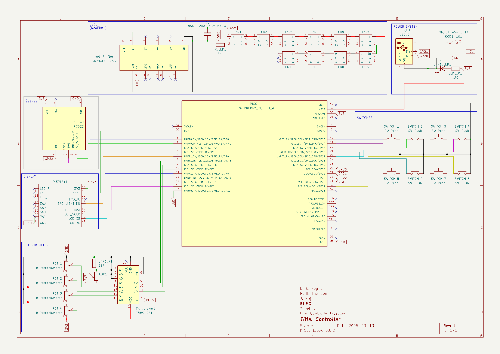

# Structure
## Components
This folder contains symbols, footprints and STEP files for components used in the circuits that are not in the default libraries of Kicad.

## Controller
This folder contains the Kicad project for the *Controller* circuit.

## Host
This folder contains the Kicad project for the *Host* circuit.
